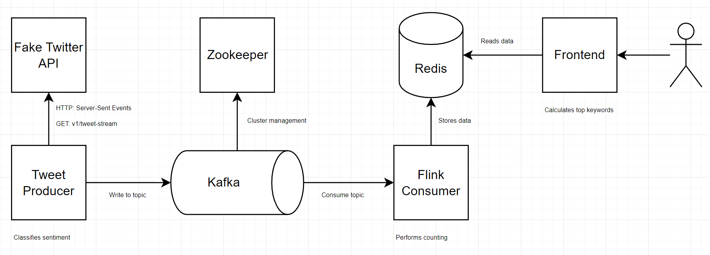

## Real-time Uranium Dashboard

#### Description

Analyze tweets, top tweet keywords, tweet sentiment, Google Trends, and stock prices for uranium in real-time.

#### Architecture

##### Fake Twitter API
-   built using RapidAPI and uses server-sent event (SSE) to simulate Twitter's streaming API for a tweets endpoint
-   fake data generated using Faker for Tweet metadata and ChatGPT to generate uranium-specific tweet text
  

##### Tweet Producer
-   consumes tweets from the Fake Twitter API
-   classifies sentiment for each tweet as either 'positive' or 'negative' using the OpenAI API (there are other analyzers one can choose from in sentiment_analysis.py)
-   pushes the sentiment-enriched tweet to a Kafka topic

##### Flink Consumer
-   uses Flink to consume tweets from a Kafka topic
-   stores raw tweets into Redis
-   counts 'positive' and 'negative' tweets in real-time and stores time-series data (10 second intervals) into Redis

##### Frontend
-   built using Streamlit and fetches data from Redis
-   resamples the 10 second interval data into longer time frames for better data visualization
-   computes the top k words among all tweets using Term Frequency - Inverse Document Frequency (TF-IDF)

#### To Run

Docker must be installed. 

Create a `.env` file with the below enviornment variables:

>OPEN_AI_KEY  
>REDIS_HOST  
>REDIS_PORT  
>REDIS_DB  

Run `docker-compose up --build`